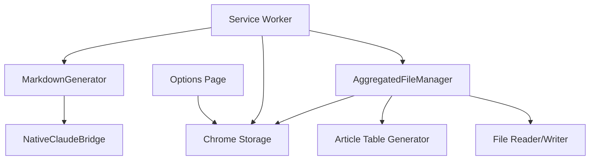

# Design Document

## Overview

記事集約保存機能は、従来の個別Markdownファイル保存を「1つの集約ファイルに記事を蓄積する方式」に変更する機能です。各記事は記事一覧表と詳細コンテンツの両方で管理され、Obsidianでの効率的な記事閲覧・管理を可能にします。既存のMarkdownGenerator、NativeMessaging、Service Workerと連携し、最小限の変更で実装されます。

## Steering Document Alignment

### Technical Standards (tech.md)
- **Chrome Extension Manifest V3**: 既存のService Worker・Content Script構成を維持
- **JavaScript ES6+**: 既存のクラスベース設計に従い、ES6 modules構成を継承
- **Native Messaging Protocol**: Claude CLI連携は既存のnative-messaging.js経由で実行
- **Chrome Storage API**: 集約ファイル設定はchrome.storage.local/syncで管理

### Project Structure (structure.md)
- **src/lib/**: AggregatedFileManagerクラスを新規追加
- **kebab-case命名**: aggregated-file-manager.jsとして配置
- **Single Responsibility**: 集約ファイル操作のみを担当する専用クラス
- **Module Import Pattern**: 既存のimport/export構成に準拠

## Code Reuse Analysis

### Existing Components to Leverage
- **MarkdownGenerator**: 記事コンテンツのMarkdown変換ロジックを再利用
- **NativeClaudeBridge**: Claude CLI経由の翻訳・要約機能を継続利用
- **Service Worker**: コンテキストメニュー・メッセージング基盤を維持
- **Chrome Storage**: 設定管理APIを拡張して集約ファイル設定を追加

### Integration Points
- **Background Script**: Service WorkerのsaveArticle関数を集約モード対応に拡張
- **Options Page**: 集約ファイル設定UI（ファイル名、保存モード切り替え）を追加
- **File System**: 既存のDownloads API経由での保存機構を集約ファイル対応に変更

## Architecture

記事集約機能は既存アーキテクチャに最小限の変更で統合され、個別保存モードとの切り替えが可能な設計となります。

### Modular Design Principles
- **Single File Responsibility**: AggregatedFileManagerは集約ファイル操作のみを担当
- **Component Isolation**: 既存MarkdownGeneratorから集約機能を分離し、新クラスで処理
- **Service Layer Separation**: UI設定・ビジネスロジック・ファイル操作の明確な分離
- **Utility Modularity**: 記事データ変換・ファイル読み込み機能を独立ユーティリティ化



## Components and Interfaces

### AggregatedFileManager
- **Purpose:** 集約Markdownファイルの読み込み・更新・記事追加処理
- **Interfaces:** 
  - `addArticleToAggregatedFile(articleData, settings)`
  - `createNewAggregatedFile(firstArticle, settings)`
  - `parseExistingAggregatedFile(filePath)`
- **Dependencies:** Chrome Storage API、Native Messaging（ファイル保存用）
- **Reuses:** MarkdownGeneratorの記事変換ロジック、ErrorHandlerのエラー処理

### ArticleTableManager
- **Purpose:** 記事一覧表の生成・更新・フォーマット処理
- **Interfaces:**
  - `generateTableHeader()`
  - `addArticleToTable(articleData, existingTable)`
  - `formatTableRow(title, url, summary, date)`
- **Dependencies:** なし（純粋関数群）
- **Reuses:** 日付フォーマット処理でMarkdownGeneratorのユーティリティを活用

### AggregatedMarkdownGenerator
- **Purpose:** 集約ファイル形式のMarkdown生成・既存コンテンツとの統合
- **Interfaces:**
  - `generateAggregatedMarkdown(articles, settings)`
  - `appendArticleContent(existingContent, newArticle)`
  - `updateTableOfContents(content)`
- **Dependencies:** MarkdownGenerator、ArticleTableManager
- **Reuses:** MarkdownGeneratorのフロントマター・コンテンツ変換機能

## Data Models

### AggregatedFileData
```javascript
{
  filePath: string,           // 集約ファイルの保存パス
  fileName: string,           // ファイル名（設定可能）
  articles: Array<Article>,   // 保存済み記事リスト
  tableContent: string,       // 記事一覧表のMarkdown
  lastUpdated: Date          // 最終更新日時
}
```

### Article
```javascript
{
  id: string,                 // 記事識別子（URL+日時ハッシュ）
  title: string,              // 記事タイトル（翻訳後）
  originalTitle: string,      // 元記事タイトル
  url: string,               // 元記事URL
  content: string,           // 翻訳済み本文
  summary: string,           // AI生成要約
  shortSummary: string,      // 表用簡潔要約（100文字以内）
  savedDate: Date,           // 保存日時
  language: string           // 元記事言語
}
```

### AggregatedFileSettings
```javascript
{
  enabled: boolean,           // 集約モード有効フラグ
  fileName: string,           // 集約ファイル名（デフォルト: "ReadLater_Articles.md"）
  maxTableSummaryLength: number, // 表内要約最大文字数（デフォルト: 100）
  autoBackup: boolean,        // 更新前バックアップ有効フラグ
  tableColumns: Array<string> // 表示カラム設定
}
```

## Error Handling

### Error Scenarios
1. **集約ファイル読み込み失敗**
   - **Handling:** 既存ファイル破損時は新規作成、アクセス権限エラー時は個別保存にフォールバック
   - **User Impact:** エラー通知表示、保存モード自動切り替えの説明

2. **集約ファイル更新中の競合**
   - **Handling:** ファイルロック機構、更新失敗時のリトライ（最大3回）
   - **User Impact:** 「更新中です...」進行状況表示、完了/失敗通知

3. **集約ファイルサイズ上限**
   - **Handling:** ファイルサイズ10MB超過時の警告、アーカイブ機能の提案
   - **User Impact:** 容量警告とファイル分割の推奨メッセージ

4. **記事データ形式エラー**
   - **Handling:** 不正データの検証・サニタイゼーション、部分保存の実行
   - **User Impact:** 部分的保存成功の通知、問題箇所の報告

## Testing Strategy

### Unit Testing
- **AggregatedFileManager**: ファイル読み書き、記事追加ロジックの単体テスト
- **ArticleTableManager**: 表生成・フォーマット機能のデータ変換テスト
- **設定管理**: Chrome Storage連携、設定値検証のモックテスト

### Integration Testing
- **Service Worker連携**: 記事保存フロー全体の統合テスト
- **Native Messaging**: Claude CLI経由の翻訳・要約・ファイル保存テスト
- **Options Page**: 設定変更と実際の保存動作の連携テスト

### End-to-End Testing
- **集約保存フロー**: 記事保存→翻訳→集約ファイル更新の完全シナリオ
- **モード切り替え**: 個別保存→集約保存の設定変更とデータ移行
- **エラー回復**: ファイル破損・ネットワークエラーからの復旧シナリオ